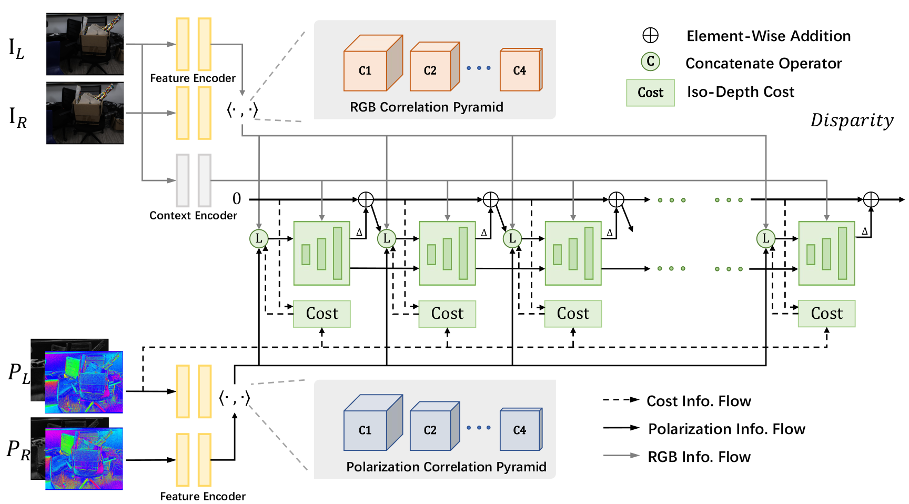

# DPS-Net: Deep Polarimetric Stereo Depth Estimation

<div align=center>

</div>

This repository is the official PyTorch implementation of the method present in 
> [DPS-Net: Deep Polarimetric Stereo Depth Estimation]()
> 
> [Chaoran Tian](), [Weihong Pan](), [Zimo Wang](), [Mao Mao](), [Guofeng Zhang](http://www.cad.zju.edu.cn/home/gfzhang/), [Hujun Bao](http://www.cad.zju.edu.cn/home/bao/), [Ping Tan](), [Zhaopeng Cui](https://zhpcui.github.io/)

 This repository is based on the [Lipson's implementation of RAFT-Stereo](https://github.com/princeton-vl/RAFT-Stereo).
It is trained and tested in Ubuntu 20.04 + PyTorch 1.10.2 + RTX 3090.

# Install
```bash
git clone https://github.com/Ethereal-Tiansss/DPS-Net.git
cd DPS-Net
conda env create -f environment.yml
conda activate dpsnet
```
# Run
## Data Preparation
### Synthetic Data
Please follow [IPS-Generator](https://github.com/Ethereal-Tian/IPS_Generator.git) to synthetic polarimetric stereo dataset named as **IPS** dataset in our paper.

### Real Data
The real polarimetric dataset is provide as well. The **RPS** dataset utilized in DPS-Net can be download from [Google Drive](https://drive.google.com/drive/folders/1R3ODf5ykpVWOP8Xtj092YbwGG3DYC6Dt?usp=sharing).

## Training
For convenience, we encapsulate all training and finetuning commands in `scripts/train_<dataset>.sh` To train our model, simply run: 

```Shell
python ./cmd/train_ips.sh
python ./cmd/train_rps.sh
```

## Evaluation
To evaluate a trained model on a test set, run
```Shell
python ./cmd/evaluate_ips.sh
python ./cmd/evaluate_rps.sh
```


## Citing
We will appreciate it if you would like to cite our work via:
```
@inproceedings{tian2023dps,
  title={DPS-Net: Deep polarimetric stereo depth estimation},
  author={Tian, Chaoran and Pan, Weihong and Wang, Zimo and Mao, Mao and Zhang, Guofeng and Bao, Hujun and Tan, Ping and Cui, Zhaopeng},
  booktitle={Proceedings of the IEEE/CVF International Conference on Computer Vision},
  pages={3569--3579},
  year={2023}
}
```
# Acknowledgement

Thanks [RAFT-Stereo](https://github.com/princeton-vl/RAFT-Stereo), for providing nice and inspiring implementations of RAFT-Stereo. Thanks [IRS](https://github.com/HKBU-HPML/IRS.git) for the open source stereo dataset, which includes the accurate surface normal and depth.  


